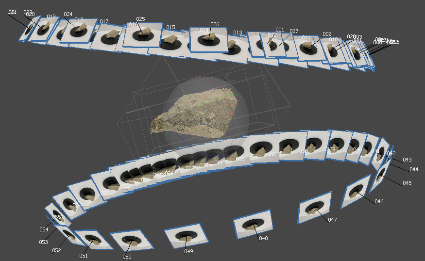
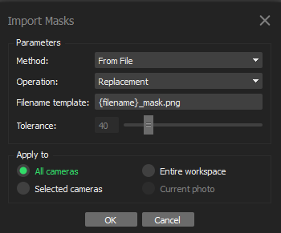
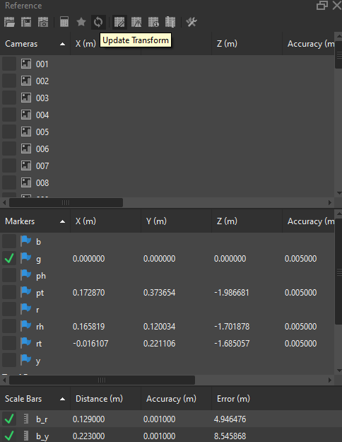
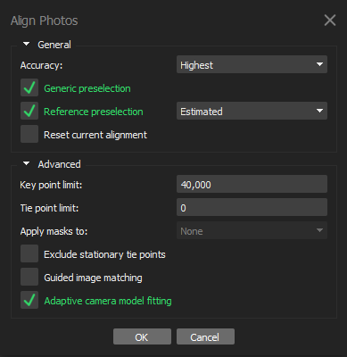

Date: 03/2021

## Overview

* Step 1: Use the folder structure provided in [template folder](../../metashape-workflow). For example, suppose we have 40 rocks in the RR3 category, we will create 40 subfolders under `RR3/` naming from `1` to `40`. Copy and paste from the given [batch job template folder](../../metashape-workflow/RR3/1).
* Step 2: Export camera images and put under each rock's subfolder. Use [rename_images.py](../../metashape-workflow/rename_images.py) if you want to have cumulative count of the image name index.
* Step 3: Use the provided [U-2-Net-Rock](../../../U-2-Net-Rock) to generate rock masks. Call the [inference script](../../../U-2-Net-Rock/u2net_test.py) and specify the image folder. Use [gather_images.py](../../metashape-workflow/gather_images.py) if you want to collect all the images and masks for training purpose.
* Step 4: Follow the workflow described in this guide to reconstruct the model of each rock. Open the `reconstruct.psx` and import photos. Then load the `batch.xml` to run the next steps described below.
* Step 5: After successful reconstruction of all rocks, use [metashape_batch_export.py](../../metashape-workflow/metashape_batch_export.py) to export the FBX models and textures and PLY models.  
* The next steps are described in the [synthesis workflow](../../../Synthesis3D/notes/synthesis-workflow/synthesis.md) section.

## Notes

*  Insert images in Typora: when we need to insert a lot of images/screenshots into .md file, Open Typora -- File -- Preferences -- Image -- Select "Copy to current folder" or "Copy to custom folder", and choose "Use relative path if possible". 
*  Use **Win+Shift+S** for screenshot. Use PowerPoint Insert - Screen Recording, **Win+Shift+R** to start, **Win+Shift+Q** to stop.

## Intro

This [blogger](https://dinosaurpalaeo.wordpress.com/category/photogrammetry/) has many useful posts on Metashape tutorial, flowchart, and tricks.

[Agisoft Metashape Professional](https://www.agisoft.com/) is a powerful Structure-from-Motion based 3D reconstruction software that performs photogrammetric processing of digital images. The main differences between Profession version (\$3499) and Standard version (\$179) is the scaling (marker reference), measurement functionalities, and export options. Another free and open-source option may be [Meshroom](https://alicevision.org/) for later deployment with IDOT.

The software allows to process images from RGB, thermal or multispectral  cameras, including multi-camera systems, into the spatial  information in the form of dense point clouds, textured polygonal models, or GIS specific format.

Metashape follows the Sfm based approach:

* Alignment. Includes Aerial Triangulation (AT) and Bundle Block Adjustment (BBA). Searches for feature points on the images and matches them across images into tie points. This step also finds the position of the camera for each image and refines camera calibration parameters (estimates internal (IO) and external (EO) camera orientation parameters).
* Reconstruction. Dense point cloud can be built based on the estimated camera positions and images themselves (dense stereo matching). 
* Create georeferenced orthomosaic (interactive drone map). Not for our purpose.

The basic workflow is:

* Add Chunks --> Add Photos
* Import Masks --> Align Photos
* Manually add markers
* Align Chunks ->- Merge Chunks
* (now on the merged chunk) Build Dense Cloud (this step can be omitted since build mesh can be based on depth maps)
* Build Mesh --> Build Texture
* Tools -- Mesh -- Generate Masks
* File -- Export -- Export Model/Masks/Texture
* For scaling: manually add markers --> Tools -- Mesh -- Measure Volume and Area

Details can be found in the [manual](./metashape_manual_1.7.pdf). For output, we can export the model and the texture map, etc.

In workflow, I created template batch process for new data. 

* Step 1: Add photos for the two chunks
* Step 2: Worflow -- Batch Process -- Batch order 1&2 (import mask & align photo). Note there is a bug in Metashape, every time we load the batch.xml file, we need to edit order 1 from "Generate Masks" to "Import Masks", and specify the mask folder
* Step 3: manually label **object and background** **markers** on chunk 1, specify scale bar, and label **object markers** on chunk 2. For 12 in. turntable, blue-red is 12.9cm, blue-yellow is 22.3cm; for 15-in. turntable, blue-red is 17.5cm, blue yellow is 29.0cm.
* Step 4: Batch order 3 & 4 (align and merge chunks) 
* Step 5: specify "merged chunk" in Batch order 5 & 6 & 7 (build mesh and texture) . Sometimes it may already select the merged chunk by default. Note for some rocks that the two-side scanning don't have very good overlap, the mesh may not close along certain boundary. In this case, we do Workflow -- Build Dense Point Cloud, and then Workflow -- Build Mesh -- Source: Dense point cloud. This usually resolves the issue. Tools -- Mesh -- Close holes may help as well.
* Step 6: Tools -- Mesh -- Measure Area and Volume. Check if volume is reasonable. In very rare case the mesh is not watertight, volume is not bounded (showing 0), and we use other approaches (mesh from dense cloud or close holes) to obtain a watertight mesh.
* Step 7: after all rocks in a parent folder is finished, use [metashape_batch_export.py](../../metashape-workflow/metashape_batch_export.py) to export the FBX models and textures and PLY models, and also collect area & volume info into spreadsheet.

For output, we can export `.fbx` format. It's easier to do that in console, with `Metashape.app.document.chunk.exportModel(path="./models/test.fbx", binary=False, precision=6, texture_format=Metashape.ImageFormatJPEG, save_texture=True, save_uv=True, save_normals=True, save_colors=True, save_cameras=False, save_markers=False, save_udim =False, save_alpha=False, strip_extensions=False, format=Metashape.ModelFormatFBX)`

For `.ply` format, `Metashape.app.document.chunk.exportModel(path="./models/RR3_2.ply", clip_to_boundary = False, format = Metashape.ModelFormatPLY, binary=True, save_cameras = False, save_comment = False, save_markers = False, save_texture = False, save_uv = False, strip_extensions = True)`

Useful tricks if we want more Python in Metashape:

* If we have many project files `.psx` and we want to use an automated Python script to batch process (e.g. export the model from each of the projects). We can either install the [stand-alone Python module from wheel](https://agisoft.freshdesk.com/support/solutions/articles/31000148930-how-to-install-metashape-stand-alone-python-module) (need license activation) OR create an empty main project and execute the [script](../../metashape-workflow/metashape_batch_export.py) (Tools -- Run script).
* If we want to include external libraries such as numpy, OpenCV and Pytorch, we can use Metashape's pip so the packages will be installed under `C:\Program Files\Agisoft\Metashape Pro\python\Lib\site-packages`. Based on [link](https://agisoft.freshdesk.com/support/solutions/articles/31000136860-how-to-install-external-python-module-to-photoscan-professional-pacakge), we can use `"%programfiles%\Agisoft\Metashape Pro\python\python.exe" -m pip install [python_module_name]`to install. Note: use the command in Windows original cmd prompt not in anaconda console or others.

## Image Capture

Photographs suitable for 3D model reconstruction in Metashape can be taken by any digital camera (both metric and non-metric), as long as you follow some specific capturing guidelines. General principles of taking and selecting pictures that provide the most appropriate data for 3D model generation:

* Use a digital camera with reasonably high resolution (5 MPix or more).
* Avoid ultra-wide angle and fisheye lenses. The best choice is 50 mm focal length (35 mm film equivalent) lenses. It is recommended to use focal length from 20 to 80 mm interval in 35mm equivalent. If a data set was captured with fisheye lens, appropriate camera sensor type should be selected in Metashape Camera Calibration dialog prior to processing.
* Fixed lenses are preferred. If zoom lenses are used - focal length should be set either to maximal or to minimal value during the entire shooting session for more stable results, for intermediate focal lengths separate camera calibration groups should be used.

In my setup, I am using ProCamera app on iPhone XR as the automatic shutter trigger, 30 consecutive shots with a 2-second interval for one surface of the rock.

## All-around Scan

I've tried several approaches to obtain a 360, all-around scan of the rocks, but many of them failed. Below is a summary and my final solution.

* **Baseline**: previously my SfM experience is taking multi-view images of a static object that we care more about its surface (top and side). Therefore, we can just put the object on the ground and taking photos by varying viewing angles to capture different facets and slightly varying the camera heights to get more information on the side surfaces. This approach almost gives no information on the rock part that is close to the ground (i.e. we get a surface floating at a distance from the ground). When we want to fully reconstruct a rock with 360 faces, this approach is no longer sufficient.

* **Laser scan**: 3D laser scan device, Gocator 2375, has been tested. Top surface is scanned, and bottom surface is scanned by flipping around the particle. This approach is found to be less satisfactory since the side information is missing and manual alignment has to be done very subjectively for the two surface point cloud. In addition, laser scan doesn't provide texture/color information.

* **Flying rock**: The gadget is made from a tripod, a clamp, and a transparent mesh bag.  The problem with this approach is: (a) for bottom-up views, the image is easily under exposure thus provide insufficient details for feature matching, and (b) the transparent mesh bag still brings noises and artifacts during the reconstruction. In crane bay (left). In doorway (right).

     

* **Turntable + stitching**: the idea is to scan and reconstruct two (or more) sides separately, and then stitch the point cloud to get a complete model. Top surface (left), bottom surface (right).

  ​	

  This is the final approach, but there are some further details to be discussed.

  * First, **background suppression**. Since here we adopt a "static camera, with object motion" approach which is different from the typical SfM scenario "static object, with camera motion", the stationary image background may confuse the algorithms. In this regard, we need to generate object masks to suppress the unintended background pixels in the images. I used a deep learning approach to ensure a more robust foreground object detection step. The network architecture used is from CVPR 2020, [U2-Net](https://github.com/xuebinqin/U-2-Net),  that is designed for salient object detection task. The train/test scripts are modified to train a rock detection network from scratch. With a few raw image-mask pairs as the starting training data, I am able to get a decent network for this specific testing experiment (white background & black turntable). The training data is prepared based on a progressive approach, which can is described in details in [appendix](#object-detection-for-background-mask-generation). The background suppression has two advantages: (a) make “static object with camera motion” and “static camera with object motion” equivalent, so the SfM runs more stably, and (b) obtain a clean point cloud without the time-consuming process of manually cleaning the background noises in a 3D point cloud (instead we do it by masking in 2D images). The effect (without and with background suppression) is shown below.

    

    

  * Second, **chunk alignment with object markers**. I have tested an approach that apply masks to the two-side image sets, treat them as a 360 shot of the object, and run SfM once to reconstruct the complete object. This was found to be unstable. For some rocks, after masking the background, SfM is able to find the correspondences between the two sets, but often times it will fail to align the photos. The reason is that the surface features are not distinct enough to be robustly matched after flipping the rock. I have also tested another approach that apply masks to the two-side image sets, reconstruct in two chunks, and align chunks by point based method. This point-based chunk alignment is automatic but unstable. The reason is also the surface features are usually not distinct enough. In this regard, we need to put markers on the object surface, reconstruct the partial rock in two separate image chunks, and accurately align the two chunks based on the marker. Details can be found in [appendix](#chunk-alignment-with-object-markers).

  * Third, **scale reference with background markers**. To get the real scale of the scanned object, we need additional markers as the "Ground Control Points". We only need this for the subset of rocks that need to compared with the ground-truth submerged volume measurement. I used color-coding labels on the turntable as background markers. Details can be found in [appendix](#scale-reference-with-background-markers). 

### Appendix

#### Object Detection for Background Mask Generation

------

* Step 1: Use the magic wand tool to manually label several images and export the masks. 

  

* Step 2: Use this small dataset to train a preliminary network that has good but not perfect performance. Then apply this preliminary network to generate the masks used for a reconstruction of many images (although the network is not perfect yet, it can already mask most of the background and get a clean reconstruction result). 

* Step 3: After successfully reconstructed the mesh of the rock, we can reverse engineer and generate masks for each photo, in Tools -- Mesh -- Generate Masks.

   

* Step 4: Then we can File -- Export -- Export Masks. Now we have many more image-mask pairs that can be added to our training data.

#### Chunk Alignment with Object Markers

------

* Step 1: Create two chunks for top scan and bottom scan. Add photos to each chunk. After mask generation, import the masks for each photo. We use the "From File" option for each images, and naming the mask with same image number + _mask suffix, and import all.

  

* Step 2: Create object markers. I used colored pencil to draw distinct patterns on the rock surface. For example, I draw a head-tail pattern with red and purple colors on two sides of the rock surface (making sure the patterns are at least visible from one of the photos in each image set).

   

* Step 3: in Metashape, "Align Photos" for both chunks by "Apply masks to Key points". This step should run smoothly since there is no confusion introduced by flipping the rock. After this step, we should have a clean reconstruction for one side without the black turntable. Apply mask to key points means only treat detected features inside the mask as effective features for matching purpose. "Apply mask to Tie points" is a different option (usually when there are much fewer masks than images, not suitable for our case), meaning that if a SIFT feature is successfully matched across N images (called a tie point, i.e. a common feature), but this feature lies in the masked region of one (or more) of the images with the background mask provided, then this feature will be removed from ALL the matched images. In our case that masks are provided for all images, this option leads to very sparse cloud since many features are excluded. 

  

* Step 4: open the photo browser, right click on the pixel to "Add marker". Switch bottomleft pane from workspace to reference, and we can rename the markers by double click the name. Here I used "p/r" for purple/red color, and "h/t" for head/tail poles. After the sparse reconstruction in align photos step, added markers on one image will automatically be projected to other images, and we can drag the markers if it's not accurate enough. Image with added markers will have a green flag, while others (automatically projected markers) will have blue flag. Usually we only need to mark two images that together see the 4 markers, in each image set.

  

* Step 5: Workflow -- Align chunks. Use "Marker based" method. Markers with the same name in two chunks will be identified and the two chunks can be accurately aligned. After successful chunk alignment, there should be a `[T]` or `[R]` after the chunk name indicating the chunk is transformed/rotated. Then we can merge two chunks and also merge the markers.

   

#### Scale Reference with Background Markers

------

* Step 1: add four color-coding markers. Check other images to see if the automatic projections looks accurate. Note that we only need to ensure for one of the image sets the markers are correctly placed, because the background markers in the two sets won't align with each other. **Important note: we should "create marker" in the pane, and "place marker" on the image, so the XYZ column should not display anything. For individual scan I didn't do this right, but for stockpile scan I did this way.**

* Step 2: in reference pane, select two markers, right click -- "Create scale bar", input the measured distance. In my setup, the blue-red distance is 12.9 cm, the blue-yellow distance is 22.3 cm. After input the measurement, we need to click "Update Transform" to apply the scaling. After that, the "Error" column should be very tiny for a successful scaling.

 

* Step 3: we can read the measured volume either from Tools -- Mesh -- Measure Area and Volume, or from the console `print(Metashape.app.document.chunk.model.volume())` to get higher precision digits.

## Stockpile Reconstruction

Stockpile reconstruction is just one side surface reconstruction, so the workflow is a little different.

There are two types of stockpile data we have:

* Medium-scale test stockpiles. Such scene has a large ground area that does not need to be reconstructed. We need to have additional steps to only reconstruct the stockpile area.
* Field stockpiles. Such quarry scene usually has a big stockpile where we only reconstruct part of the stockpile surface. For these scenes we just do Step 1 & 2  & 5 & 6 & 7 assuming that all reconstructed regions are meaningful regions.

The workflow is built into the following batch process. And the template project is at [here](../../metashape-workflow/stockpile).

Sequence: check order 1 -- manual cleaning on sparse cloud -- check orders 2 to 8 all at once -- manual cleaning on dense cloud and mesh.

* Step 0: video to frames. see [ffmpeg guide](../ffmpeg_guide/ffmpeg_guide.md)
* Step 1: Add photos to 'photo' chunk and 'frame' chunk **(manual)**. 
* Step 2: Workflow -- Align photos **(batch order 1)**. This step resolves image pairs and gives a sparse point cloud. Different from individual particle scan, here I set "Accuracy: Highest" and "Tie point limit: 0" (0 means unlimited) and "Adaptive camera model fitting" checked.

* Step 3: clean sparse cloud **(manual)**. Usually we only want the stockpile area to be reconstructed, but for such scene we don't have U-Net masks for each image. We first manually clean the cloud by selection --> invert selection --> delete. We can further go to Model -- Gradual selection -- Reprojection uncertainty -- adjust the threshold to around 100 or lower -- delete selected points. The solution is to generate a rough mesh from the manually cleaned sparse cloud --> generate rough ROI masks and use them during dense reconstruction.
* Step 4: optimize cameras (Tools -- Optimize cameras) and build rough mesh (Workflow -- Build Mesh, source: Sparse cloud) and generate object masks (Tools -- Mesh -- Generate Masks) and apply masks (File -- Import -- Import masks -- From model), **(batch order 2 & 3 & 4 & 5 & 6)**. Since we clean up some points in the sparse cloud, we can update the camera parameters based on the cleaned tie points. Here I noticed that some points are cut off above certain height. Initially I think it's because we didn't take enough top views of the stockpile. But later on I found there is an automatic bbox region decided by Metashape after the alignment step 2 ([link](https://www.agisoft.com/forum/index.php?topic=13225.0)). For stockpile with a ground, the bbox somehow doesn't encompass all sparse points. Do Model -- Transform region -- Reset region to fit the bbox to all points. Note that every batch process we should manually change the "import mask" step due to a Metashape bug described before (it's changed to "Generate masks" every time loaded).

* Step 5: build dense cloud (for deep learning), and mesh (for graph approach) **(batch order 7 & 8)**. Then we can do manual cleaning on the cloud and mesh to remove a small portion of ground.
* Step 6: label markers and specify scale bars (described previously in all-around scan section) 
* Step 7: export cloud and mesh models ([script](../../metashape_workflow/metashape_batch_export_stockpile.py)).

