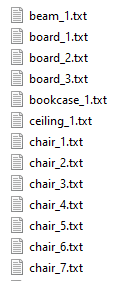

Check [PyTorch Points 3D](https://github.com/nicolas-chaulet/torch-points3d) framework! It has PointGroup implemented. Maybe it's an element solution for my future implementations.

GICN repo: [link](https://github.com/LiuShihHung/GICN), [paper](https://arxiv.org/abs/2007.09860)

Raw S3DIS dataset: [link](https://drive.google.com/open?id=0BweDykwS9vIoUG5nNGRjQmFLTGM), [paper](http://buildingparser.stanford.edu/images/3D_Semantic_Parsing.pdf)

JSIS3D pre-processed dataset: [link](https://drive.google.com/drive/folders/1s1cFfb8cInM-SNHQoTGxN9BIyNpNQK6x), [paper](https://arxiv.org/pdf/1904.00699.pdf)

### preprocess S3DIS dataset

raw dataset is organized as: for each room in each area (like `Area_1/conferenceRoom_1`), it has the points belonging to each instance of each class in a separate file. Each point is **(x,y,z,r,g,b)**. RGB is in 255.



* Step 1: JSIS3D collect these annotations into one npy file per each room (a room is a scene). By parsing the annotations, each point now becomes **(x,y,z,r,g,b,sem,ins)**. `sem` is the class ID (0 to 12), `ins` is the instance ID (0 to N). Instance ID is counted per scene. See [`collect_annotations.py`](https://github.com/pqhieu/jsis3d/blob/master/scripts/collect_annotations.py)

* Step 2: JSIS3D convert the npy into block-wise h5 file per each room. First, divide the 2D X-Y space into 1m*1m cells with stride=0.5m, i.e. **the cells has overlap**! If the points in a cell is less than threshold (default 100), ignore this cell. Then, sample the "cell" into a fixed number of points (say 4096) and call it a "block". The sampling can be downsample (randomly pick unique points) or upsample (randomly repeat current points). Then the h5 is a 3D tensor (B=Num_of_blocks * N=4096 * 14), with fields **(x_global,y_global,z_global,x_block,y_block,z,r,g,b,x_normalized, y_normalized,z_normalized,sem,ins)**. 

  * (x_global, y_global, z_global) is global coordinates (already shifted to start from (0,0,0))
  * (x_block, y_block, z) is block normalized coordinates. For example, x_block = x - (min_x + block_x_length/2), it centers the points around the midpoint of its X boundary (into range [-x_length/2, +x_length/2]). z is just z since JSIS3D don't divide along z direction (but ideally we should do that). **GICN doesn't use this!** It's ignored in the dataset loading step.
  * (r,g,b) is the RGB color in [0,1].
  * (x/y/z_normalized) is the cloud normalized coordinates that scale the entire scene into a (1,1,1) 3D box. 
  * (x_global,y_global,z_global) is in key `coords`, (sem,ins) is in key `labels`, the middle part (x_block,y_block,z,r,g,b,x_normalized, y_normalized,z_normalize) is in key `points`. See [`prepare_h5.py`](https://github.com/pqhieu/jsis3d/blob/master/scripts/prepare_h5.py)
  * Later in GICN [`dataset.py`](https://github.com/LiuShihHung/GICN/blob/29cd2975e539cf09e270159934d4ca3a7da01f0a/dataset.py#L144), local coordinates within each block in range [0,1] is further calculated based on the global coordinates and used as per-point feature during training. **This block-wise [0,1] coordinates makes most sense for effective learning**. Actually I can directly compute this during pre-processing and replace the x/y/z_block with these values.
  * In GICN, the global instance label is further re-mapped to per-block instance label. **This is important for effective learning.**

  Two questions in this step:

  * The cell is 2D on XY, so it's actually a long column that can contain any Z values. Explanation: 3D division may result in many empty blocks. Especially for our stockpile surface, it's just a surface instead on spatial voxels
  * In GICN, when it's further converted into [0,1] block normalized coordinates, the Z is also normalized, so the points are normalized from a long column into a cube, which may lead to skewed effect. We should divide into 3D cells also considering the Z division
  * Overlap between adjacent cells. Explanation: at the block boundary, an instance can be cut through and result in partial shape, add overlap can eliminate this effect to certain extent

* Step 3: JSIS3D computes the average number of points per instance for each class. For example, in a room, the class chair may have 3 instances, each having 1000/2000/4000 points respectively. Then, the average is 3500 points per instance. This is called the `mean size` and saved in `sizes.txt`. See [`estimate_mean_size.py`](https://github.com/pqhieu/jsis3d/blob/master/scripts/estimate_mean_size.py). It also computes the relative frequency for each class. For example, across all the areas and rooms in the training set, the percentage of 4 classes is (0.1,0.2,0.4,0.3). The median frequency is 0.25. Now the relative frequency is `median_freq/freq` = (2.5,1.25, 0.675, 0.83). So weight > 1 indicates less frequent class, < 1 indicates more frequent class. This is called the `weight` and saved in `weight.txt`. See [`estimate_mediean_freq.py`](https://github.com/pqhieu/jsis3d/blob/master/scripts/estimate_median_freq.py). Not used in GICN.

The following steps are for Windows 10, Visual Studio 2017, RTX 2080 Ti GPU (Turing), CUDA 10.2 Toolkit.

### Things about CUDA version

The very first thing, is to verify the inter-compatibility between **(a) GPU architecture (b) CUDA Toolkit version (c) cuDNN version** in the [support matrix](https://docs.nvidia.com/deeplearning/cudnn/support-matrix/index.html). Make sure the deployed environment has the right combination of the three. For example, the latest Ampere GPU (RTX 3080) doesn't support CUDA Toolkit before 11.0.

CUDA has 2 APIs ([post](https://stackoverflow.com/questions/53422407/different-cuda-versions-shown-by-nvcc-and-nvidia-smi)):

* Driver API (`libcuda.so`). Installed by GPU driver installer. Version is what shown in `nvidia-smi`.
* Runtime API (`libcudart.so`). Installed by CUDA toolkit installer. Version is what shown in `nvcc -V`

The version of the above two does not necessarily match. And usually Driver API version >= Runtime API version. Runtime API version is what is being used in deep learning.

Depending on we're doing C++ developing or Python developing:

* If you want to develop CUDA C++ programs --> Install CUDA Toolkit Runtime API strictly following [linux guide](https://docs.nvidia.com/cuda/cuda-installation-guide-linux/index.html) and [windows guide](https://docs.nvidia.com/cuda/cuda-installation-guide-microsoft-windows/index.html). This installation is **system-wide**. For example, if you want to compile a C++ extension/library for Python, you should make sure the base system has the correct CUDA version installed to compile the program. Which CUDA version (base or env) will be used when build from source by calling `(venv) python setup.py install` I still need to figure out.

* If you want to develop Python programs (deep learning) --> Install CUDA Toolkit and cuDNN inside conda environment! This installation is **environment-wide**. Python execution will follow the CUDA version installed inside the environment. (**Caveat**: this cudatoolkit installed in conda is just for pytorch or other Python packages to work. It's a subset of CUDA Toolkit, also it doesn't have nvcc...Therefore, if you want to build from source like `(venv) python setup.py install` you must have CUDA Toolkit installed in your base environment as system-wide!)

  ```bash
  conda search cudatoolkit
  conda search cudnn # check available versions
  conda install cudatoolkit=10.0.130 cudnn=7.6.0=cuda10.0_0 # for cudnn also specify the build as the cudatoolkit version installed
  ```

### conda env setup

create env in a non-default path (use --prefix). This can also be used to move environment to a new location! Just create an empty env with prefix and copy all the folders to this new one.

```bash
conda create --prefix H:\envs\gicn python=3.6
conda activate H:\envs\gicn # need to activate in this way
H:\envs\gicn\Scripts\pip.exe install [package] # pip install in this way

# conda clean
conda clean --all --dry-run # show prunable packages. remove --dry-run to actually clean up

# notebook
conda install -c anaconda ipykernel # jupyter notebook
python -m ipykernel install --user --name=gicn # enable venv kernel in notebook
# on windows the jupyter notebook is a little weird, find the jupyter notebook (gicn) in search bar, right click Properties, and in Target field change `%USERPROFILE%` to another drive `H:/`. Otherwise it's always loading C drive
H:\envs\gicn\Scripts\pip.exe install jupyterthemes
jt -t onedork -f roboto -fs 11 # theme, font, and fontsize

conda install pytorch==1.7.0 torchvision==0.8.0 cudatoolkit=10.2 -c pytorch # cuda 11.1 not working
conda install h5py tqdm scipy
H:\envs\gicn\Scripts\pip.exe install open3d==0.13.0
# or for developer version
H:\envs\gicn\Scripts\pip.exe install --user --pre https://storage.googleapis.com/open3d-releases-master/python-wheels/open3d-0.12.0+7e813a8-cp36-cp36m-win_amd64.whl

H:\envs\gicn\Scripts\pip.exe install lera

H:\envs\gicn\Scripts\pip.exe install plyfile
```

### compile PointNet++ module

```bash
cd Pointnet2.PyTorch/pointnet2
python setup.py install
```

on Windows you'll get error `H:/envs/gicn/lib/site-packages/torch/include\torch/csrc/jit/ir/ir.h(1347): error: member "torch::jit::ProfileOptionalOp::Kind" may not be initialized`. A solution was found to be just [comment out the line](https://github.com/facebookresearch/detectron2/issues/9#issuecomment-735284929). Magic!

### compile sparse convnet (SCN) module

```bash
git clone https://github.com/facebookresearch/SparseConvNet.git
cd SparseConvNet
sh develop.sh
```

I'm using Visual Studio 2017, i.e. cl.exe to compile. [someone](https://github.com/facebookresearch/SparseConvNet/issues/128#issuecomment-668839183) managed to build on Windows. The notes below is based on his notes.

* Fix 1: compiler flag. The bash script `develop.sh` is for Linux. We need to fix some compiler flags for Windows since we use MSVC compiler `cl.exe`. For example,  in `setup.py`, for `cxx` flags, `-fopenmp` is `/openmp`, `-O3` is `/O2`, add `/permissive-` to suppress cuda syntax inconsistency; for `nvcc` flags, remove `-fopenmp` and `-O3` since nvcc has no such options, and on Windows unrecognized options may be regarded as file name and gives error `nvcc fatal   : A single input file is required for a non-link phase when an outputfile is specified`

* Fix 2: PyTorch use of std libraries when build from source. PyTorch has many places in its source files that lead to error "Ambiguous symbol" when compiled with MSVC, this is because the pytorch source code doesn't specify the global scope for some std. See [this](https://github.com/pytorch/pytorch/pull/17863/files).

  ```bash
  H:\envs\gicn\lib\site-packages\torch\include\torch\csrc\api\include\torch/data/detail/sequencers.h(108): error C2872: 'std': ambiguous symbol
  C:\Program Files (x86)\Microsoft Visual Studio\2017\Professional\VC\Tools\MSVC\14.16.27023\include\queue(451): note: could be 'std'
  H:\envs\gicn\lib\site-packages\torch\include\torch\csrc\api\include\torch/data/detail/sequencers.h(108): note: or       'std'
  ```

  Fix is to add `::` at each line indicated in the error, for example queue.h(78) and sequencers.h (108), etc.:

  ```c++
  std::queue<T> queue_; -- > ::std::queue<T> queue_;
  std::mutex mutex_; --> ::std::mutex mutex_;
  std::condition_variable cv_; --> ::std::condition_variable cv_;
  ```

- Fix 3: SCN `<tr1/functional> file not found error`
	- "tr1" was a temporary namespace that was in use when "functional" was still not part of the C++ standard. 
	- In "sparseconfig.h" under "sparseconvnet\SCN\Metadata\sparsehash\internal", made the following changes:
		- Changed `#define HASH_FUN_H <tr1/functional>` to `#define HASH_FUN_H <functional>`
		- Changed `#define HASH_NAMESPACE std::tr1` to `#define HASH_NAMESPACE std`

- Fix 4: SCN`c:\blahblah\SparseConvNet\sparseconvnet\SCN\Metadata\sparsehash\internal\hashtable-common.h(166): error C2760: syntax error: unexpected token 'typedef', expected ';`
	- In hashtable-common.h, changed two lines of `SPARSEHASH_COMPILE_ASSERT(static_cast<IntType>(-1) > static_cast<IntType>(0), serializing_int_requires_an_unsigned_type);` to `static_assert(static_cast<IntType>(-1) > static_cast<IntType>(0), "message");`
- Fix 5: SCN `error: expected a ")"`. On windows nvcc always call MSVC as host compiler, thus doesn't support C++ 14 or newer. But in the sparse conv .cu files, it uses `and/or` keyword from c++14 (in the macro definition of FOO(T,K,V) and many other places). Find them and Change it to `&&/||`! 
- Fix 6: pow() signature. `c:\blahblah\SparseConvNet\sparseconvnet\SCN\CUDA/BatchNormalization.cu(83): error: calling a __host__ function("pow<float, double, (int)0> ") from a __global__ function("BatchNormalization_f_test<float, (int)16, (int)64> ") is not allowed`
  - Changed two pow functions in BatchNormalization.cu "pow(_saveInvStd / nActive + eps, -0.5)" to "pow(double(_saveInvStd / nActive + eps), -0.5)". Otherwise, the calling signature happens to be pow(float, double) which does not correspond to the signature of any variant of "pow" function available on CUDA.
- Fix 7: long datatype. code meant to be cross-platform should not be using "long". It would end up being 32 bit wide on 64-bit Windows machines while being 64 bit wide on 64-bit Linux machines. Change every `long` to `int64_t`, in all files (especially /CPU/SparseToDense.cpp, /CUDA/SparseToDense.cu)!! Caveat: except files `type_traits.h`! This solves error `c:\blahblah\SparseConvNet\sparseconvnet\SCN\CUDA/SparseToDense.cpp(29): error C2664: 'at::Tensor &at::Tensor::resize_(c10::IntArrayRef,c10::optional<c10::MemoryFormat>) const': cannot convert argument 1 from 'std::array<long,3>' to 'c10::IntArrayRef'`, and link error `sparseconvnet_cuda.obj : error LNK2001: unresolved external symbol "public: long * __cdecl at::Tensor::data_ptr<long>(void)const " (??$data_ptr@J@Tensor@at@@QEBAPEAJXZ)`.  
  - Note that in `RectangularRegions.h`, type cast to obey the std::max/min signature, `std::max(0L, (long)((input[i] - size[i] + stride[i]) / stride[i]))`

FINALLY!

### run GICN

In `train.py`:

* Fix 1: windows multiprocessing may result in `RuntimeError:Attempt to start a new process before the current process has finished its bootstrapping phase.` error. Put everything (including the import modules. defined functions can be outside) inside a `if __name__ == '__main__':` guard.

* Fix 2: original version has multi-GPU training. We need set the `os.environ["CUDA_VISIBLE_DEVICES"]` and `device_ids` in `nn.DataParallel()` (or just comment out the `nn.DataParallel` line) for single GPU. Also adjust batchsize and num_workers on Windows

* Fix 3: comment out 

  ```
  os.system('cp train_new.py %s' % (LOG_DIR)) # bkp of train procedure
  os.system('cp new_bonet.py %s' % (LOG_DIR)) # bkp of train procedure
  ```

* In `Get_instance_size()`, `gt_instance_size = torch.zeros((batch_size, 20)).cuda()` 20 means ..., change to ...

In `dataset.py`:

* Fix 1: the keys are inconsistent in GICN code and the JSIS3D h5 data. The only keys are `coords`, `points`, `labels`. See definition [here](https://github.com/pqhieu/jsis3d/blob/master/scripts/prepare_h5.py). Accordingly, in `load_full_file_list()` and `load_raw_data_file_s3dis_block()`, change all `fin['semIns_labels']` to `fin['labels']`. Also, in `load_raw_data_file_s3dis_block()`, `pc_indices` is never used, comment out the line.

In `data_plot.py`:

* Just `import open3d`
* The original is on open3d 0.3.0. There are API changes in 0.12.0 version.

Download pre-processed S3DIS data from [JSIS3D](https://github.com/pqhieu/jsis3d) and place under datasets folder, set the correct dataset_path.

In `test.py`:

* `from new_bonet import` to `from gicn_model import`, and remove `sem`

### Questions & Notes

* `gicn_model.py`: box_center_net, BatchNorm layer not used
* 

### Open3D

At the time being, I need to sync the camera views across subplots, so the `copy_from()` function in the Camera class is very helpful. But this is only available in the [latest developer version](http://www.open3d.org/docs/latest/python_api/open3d.visualization.rendering.Camera.html#open3d.visualization.rendering.Camera.copy_from), not in the 0.12.0 stable release.

To install the latest developer version, we need to download the wheel and pip install. See [here](http://www.open3d.org/docs/latest/getting_started.html#development-version-pip).

Caveat: the latest developer version doesn't support open the window in Jupyter Notebook. So for running in terminal, developer version is fine; for runnng in Jupyter Notebook, use the stable release.

