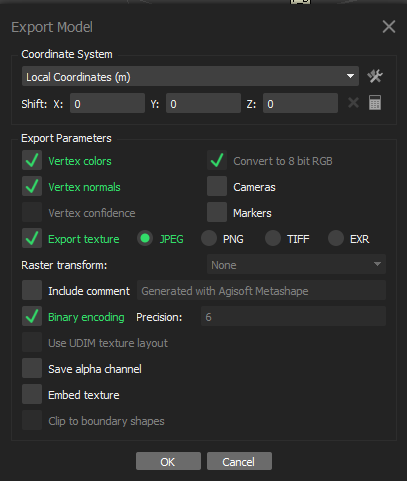
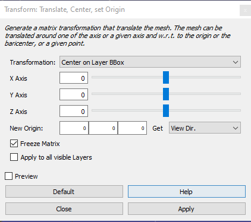
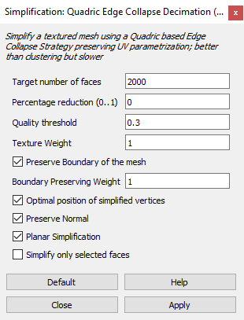
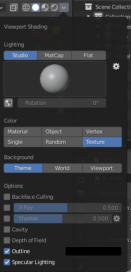

# Synthesis3D Guide

[TOC]

This section is after the [3D reconstruction section](../../../Reconstruction3D/notes/agisoft	_metashape_guide/agisoft_metashape_guide.md).

As the preparation steps for 3D synthetic data generation in Unity, the following major tasks are necessary:

* Step 1: Export Reconstructed Rock Models (Metashape)
* Step 2: Mesh Re-centering/Simplification/Downsampling (MeshLab)
* Step 3: Fabricate Level-of-Detail (LOD) Model (Blender)
* Step 4: Import to Unity

After the steps above, the synthetic data generation in Unity requires the following major tasks:

* Step 1: Instantiation of Rock Models
* Step 2: Stockpile Generation by Gravity Falling
* Step 3: Multi-View Image Data Generation by Programming Camera Movement
* Step 4: 3D Point Cloud Data Generation by Ray Casting
* Step 5: Export Synthetic Data

## Export Reconstructed Rock Models from Metashape

Which data format is the most suitable? The Autodesk FBX file format is a popular 3D data interchange format utilized between 3D editors and graphics engines. Unity generally takes .fbx or .obj as mesh model. MeshLab can import but cannot export .fbx. .fbx model is more compressed than .obj model. As a result, I choose .fbx as the protocol format between Metashap & Meshlab as well as between Blender & Unity, and choose .obj as the protocol format between MeshLab & Blender. 

To export model from Metashape with texture, File -- Export -- Export Model, save colors and normals, and export texture as a separate file (jpeg was found to have the smallest size). If "Embed texture" is checked, there will be an extra `.fbm` folder. I found this is not necessary, Unity/MeshLab/Blender can automatically match the texture file with the model. 

As a result, for each rock we have a raw `.fbx` model and a `.jpg` texture.

## Mesh Re-centering/Simplification/Downsampling in MeshLab

First, after reconstruction, the model is usually with certain offset. It is better to re-center the model to its centroid. This can be done in MeshLab by Filters -- Normals, Curvatures, and Orientation --  Transform: Translate, center, set origin -- Center on Scene/Layer BBox -- Freeze Matrix, as described [here](https://revthat.com/updating-origin-meshes-meshlab/). 

Second, the model needs to be downsampled to be smoothly rendered in Unity. Filters -- Remeshing, Simplification, Reconstruction -- Simplification: Quadric Edge Collapse Decimation (with Texture). Since we want 3 LOD levels in Unity, we may target at 2000, 1000, 500 faces.

This is called decimating mesh in graphics.

In addition, geometry properties can be computed in Meshlab, Filters -- Quality Measures computations -- Compute Geometric Measures. It computes bounding box, surface area, barycenter, volume, etc. Can check source code, the volume calculation is based on "Mirtich, B. (1996). Fast and accurate computation of polyhedral mass properties. *Journal of graphics tools*, *1*(2), 31-50."

To automate everything, three options are available:

* Latest release [PyMeshLab](https://github.com/cnr-isti-vclab/PyMeshLab) library with the 2020.12 version! It offers the most efficient Python API of MeshLab. And it's official. This option is the best solution.
* Record the script from Filters -- show current filter script -- save/load script. This is ok, but no longer supported after the release of PyMeshLab. This option is not used.
* Python library MeshLabXML. This one provides more flexible interfaces, however, it is not official API so it may not work with the latest version of MeshLab. This option is not used.

The batch processing Python script is [here](../../synthesis-workflow/meshlab_LOD_generation.py).

## Fabricate Level-of-Detail (LOD) Model in Blender

Blender tips:

* Alt + mid mouse: auto focus on mouse
* Show texture with model: on the upper right corner, switch to solid mode, click the drop down, and choose texture in color.

## Import to Unity

