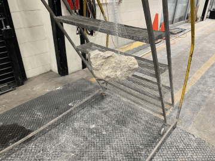
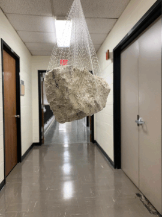

Date: 03/2021

Some notes on when we need to insert a lot of images/screenshots into .md file, Open Typora -- File -- Preferences -- Image -- Select "Copy to current folder" or "Copy to custom folder", and choose "Use relative path if possible". Use Win+Shift+S for screenshot.

## Intro

[Agisoft Metashape Professional](https://www.agisoft.com/) is a powerful Structure-from-Motion based 3D reconstruction software that performs photogrammetric processing of digital images. The main differences between Profession version (\$3499) and Standard version (\$179) is the scaling (marker reference), measurement functionalities, and export options.

The software allows to process images from RGB, thermal or multispectral  cameras, including multi-camera systems, into the spatial  information in the form of dense point clouds, textured polygonal models, or GIS specific format.

Metashape follows the Sfm based approach:

* Alignment. Includes Aerial Triangulation (AT) and Bundle Block Adjustment (BBA). Searches for feature points on the images and matches them across images into tie points. This step also finds the position of the camera for each image and refines camera calibration parameters (estimates internal (IO) and external (EO) camera orientation parameters).
* Reconstruction. Dense point cloud can be built based on the estimated camera positions and images themselves (dense stereo matching). 
* Create georeferenced orthomosaic (interactive drone map). Not for our purpose.

Details can be found in the  [manual](./metashape_manual_1.7.pdf).

## Image Capture

Photographs suitable for 3D model reconstruction in Metashape can be taken by any digital camera (both metric and non-metric), as long as you follow some specific capturing guidelines. General principles of taking and selecting pictures that provide the most appropriate data for 3D model generation:

* Use a digital camera with reasonably high resolution (5 MPix or more).
* Avoid ultra-wide angle and fisheye lenses. The best choice is 50 mm focal length (35 mm film equivalent) lenses. It is recommended to use focal length from 20 to 80 mm interval in 35mm equivalent. If a data set was captured with fisheye lens, appropriate camera sensor type should be selected in Metashape Camera Calibration dialog prior to processing.
* Fixed lenses are preferred. If zoom lenses are used - focal length should be set either to maximal or to minimal value during the entire shooting session for more stable results, for intermediate focal lengths separate camera calibration groups should be used.

## All-around Scan

I've tried several approaches to obtain a 360, all-around scan of the rocks, but many of them failed. Below is a summary and my final solution.

* Baseline: previously my SfM experience is taking multi-view images of a static object that we care more about its surface (top and side). Therefore, we can just put the object on the ground and taking photos by varying viewing angles to capture different facets and slightly varying the camera heights to get more information on the side surfaces. This approach almost gives no information on the rock part that is close to the ground (i.e. we get a surface floating at a distance from the ground). When we want to fully reconstruct a rock with 360 faces, this approach is no longer sufficient.

* Flying rock: In crane bay (left). In doorway (right). The problem with this approach

     

