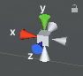

# Resources

* [PaperwithCode](https://paperswithcode.com/)

How to convert from 3D model to surface point cloud?

* backface culling to remove occluded/unseen points
* check surface mesh -> point cloud

What are the types of synthetic training data?

* Direct point cloud after backface culling. GT label is known from 3D model.
* Customized SfM with pixel label from each 2D image (need to modify SfM algorithms a little) --> reconstructed point cloud will have a class label attribute at each point. GT label is known from the projected 2D images.
* Optic flow to detect & track & reconstruct? not very clear to me currently.

Next steps:

* Moving camera, [video](https://www.youtube.com/watch?v=p_4xfhelak8), [video](https://www.youtube.com/watch?v=bbnVpPiQ_rU), [video](https://www.youtube.com/watch?v=iZjnDaabIKU)
* Mesh to point cloud, [post](https://answers.unity.com/questions/851654/generate-a-point-cloud-from-a-mesh.html), [post](https://stackoverflow.com/questions/33397073/how-to-show-vertices-on-a-cube-when-selected-in-unity-during-runtime)

# Unity3D

Right click this to change projection from **orthographic** to **perspective**, and the common viewing directions.



| Action      | Shortcuts (Mac)                                              |
| ----------- | ------------------------------------------------------------ |
| Hand tool   | Q                                                            |
| Move tool   | W, click the object, you can move along X/Y/Z axis           |
| Rotate tool | E, click the object, you can rotate along X/Y/Z axis         |
| Scale tool  | R, click the object, drag the center cude to scale uniformly |
| Pan         | Option/Alt + Cmd + drag                                      |
| Orbit       | Option/Alt + drag                                            |
| Zoom        | Two fingers up & down                                        |
| Focus       | Select an object, press F                                    |
| Flythrough  | Two fingers pressed, WASDQE to move, Shift to faster         |

#### Level of Details (LOD)

Each GameObject can have different LOD when displayed. This can be done [by modeling software and import to Unity](https://docs.unity3d.com/Manual/importing-lod-meshes.html). LOD 0 is the most detailed version.

#### Mesh Collider

To enable collision, we need to add Mesh Collider to the object model, check "Convex", and choose  Mesh to be the lowest LOD mesh. Then, add Rigidbody component to enable gravity

#### Debug print

```c#
using System; // for String class

Debug.Log(String.Format("hello world {0}", 1)); // 1
Debug.Log(String.Format("hello world {0:0.00}", 1m)); // 1.00, m is decimal, f is float
// decimal in C# represents "exact" floating point, while float/double is approximation of the value. When you want exact number, decimal is better.
string s = "wow";
Debug.Log("hello world" + s); // string is basic type, you can + like python
```

#### Save file

```c#
using System.IO;

public string saveFilePath = Application.dataPath + "/"; // default datapath is <path to project folder>/Assets
```

#### Functions & Coroutines

Functions must complete within a single frame update. Coroutines can across many frames. For behaviors that should be rendered over time, we should use coroutine.

A coroutine is like a function that has the ability to **pause execution** and return control to Unity but then to c**ontinue where it left off** on the following frame. It is essentially a function declared with a **return type of IEnumerator** and with the **yield return statement** included somewhere in the body.

```c#
IEnumerator Fade() 
{
    for (float ft = 1f; ft >= 0; ft -= 0.1f) 
    {
        Color c = renderer.material.color;
        c.a = ft;
        renderer.material.color = c;
        yield return null;
      	// yield return new WaitForSeconds(.1f); // with this delay we can have async call to this coroutine, i.e. no need to call every frame
    }
}

void Update()
{
    if (Input.GetKeyDown("f")) 
    {
        StartCoroutine("Fade");
    }
}
```

#### Scriptable Object

Typically used to manage the common traits across entities. It's like defining the data strcuture and inheritance.

```c#
public abstract class	Animal : ScriptableObject
{
  ...
  public abstract void Bark();
} // abstract is like virtual in C++

public class Dog : Animal
{
  public override void Bark()
  {
    // wong wong
    // meow meow
  }
}
```

#### UI

In scene, right click--UI--we can add **canvas** and **button**, etc. 

Canvas will overlay the UI elements onto the camera view (by default). 

When the game window is resized, the canvas is automatically resized too. So to fix the relative location of button w.r.t to canvas, we need set the anchor e.g. to top left corner of the canvas

#### Path Following

[simple movement](https://www.youtube.com/watch?v=-pmDRgp7ECY), [Bezier curve](https://www.youtube.com/watch?v=11ofnLOE8pw)

#### C# basics

```c#
List<int> l = new List<int> {1,2,3};
l.Add(4); // append
l.Remove(2); // remove the 1st occurence
l.RemoveAt(3); // remove at index
l.Insert(1, 3); // insert 3 to l[1]
l.Count
l.Capacity
  
Dictionary<int, List<int>> d;
foreach (var entry in d)
  entry.Key
  entry.Value
 
foreach (var keys in d.Keys) or foreach (var values in d.Values)
```

**Value Type vs. Reference Type**

| Type           | Examples                  |
| -------------- | ------------------------- |
| Value Type     | bool, char, int, float... |
| Reference Type | string, array, class, ... |

**yield return/yield break**

everytime when the function is called, when the **yield return** statement is reached the value is returned, and the current location in code is **retained**. Execution is **restarted** from that location the next time that the iterator function is called.

```c#
IEnumerable<int> GenerateWithYield() 
{ 
    var i = 0; 
    while (i<5) 
        yield return ++i; 
}
foreach(var number in GenerateWithYield()) 
    Console.WriteLine(number);
```

**yield break** will mark the iterator as ended.


## VSCode with Unity

See [guide](https://code.visualstudio.com/docs/other/unity). Install .NET, Mono stable release, and C# & Debugger for Unity & Unity Tools three extensions.

* IntelliSense: at the beginning IntelliSense doesn't work. Preferences--Settings--search "omnisharp"--section "Omnisharp: Use Global Mono"--change to "Always"--Reload

* Debugger: On the Debugger page in vscode, first time click "create a launch.json" file and select "Unity Debugger". Now you can start the debugger, set breakpoints, and to debug just go to Unity and start the game, the debugging will start.
* Interactive debugging: in vscode debug console, we can type variable, its fields, etc. Very useful

* Doc: Select a function, `cmd+'` to open Unity doc. Or `cmd+shift+'` to search a certain function name.

# Image Synthesis

* Following this [tutorial](https://www.youtube.com/watch?v=P4CCMvtUohA), Download ImageSynthesis project from this [repo](https://bitbucket.org/Unity-Technologies/ml-imagesynthesis/src/master/).

* In Unity Hub, add the repo and specify the Unity version. This project was created in an older Unity version, so we just allow it to update and reimport into the current version, 2019.4.12f1.

* When we create a new scene, we drag /ImageSynthesis/ImageSynthesis.cs to the main camera's "Add Component" panel. Now if we add new Game window and switch between "Display 1" to "Display 8", after running it will show the camera view.

#### Chages made in original ImageSynthesis.cs

* For camera view saving, added the option to save a specific display. See `Save()`

# 3D Reconstruction


# 3D Segmentation

## Synthetic Dataset

Synthetic Dataset + Unity3D

* [blog](https://blogs.unity3d.com/2020/06/10/use-unitys-perception-tools-to-generate-and-analyze-synthetic-data-at-scale-to-train-your-ml-models/), [blog](https://blogs.unity3d.com/2020/05/01/synthetic-data-simulating-myriad-possibilities-to-train-robust-machine-learning-models/)
* [Google AI paper](https://arxiv.org/pdf/1902.09967.pdf)
* [SynthDet github](https://github.com/Unity-Technologies/SynthDet) and associated [blog](https://blogs.unity3d.com/2020/09/17/training-a-performant-object-detection-ml-model-on-synthetic-data-using-unity-perception-tools/): use Unity to generate data for object detection. Inspired by the Google paper above
* [tutorial](https://www.youtube.com/watch?v=lHXcYhyhHGA): render Pokemon models on different backgrounds as 2D images
* [tutorial](https://www.youtube.com/watch?v=QxMuWuk_W10): Valohai
* [tutorial](https://www.bilibili.com/video/av33383354/): Python-Unity
* [tutorial](https://www.youtube.com/watch?v=ddy12WHqt-M): terrain generation

## 3D Instance Segmentation Networks

